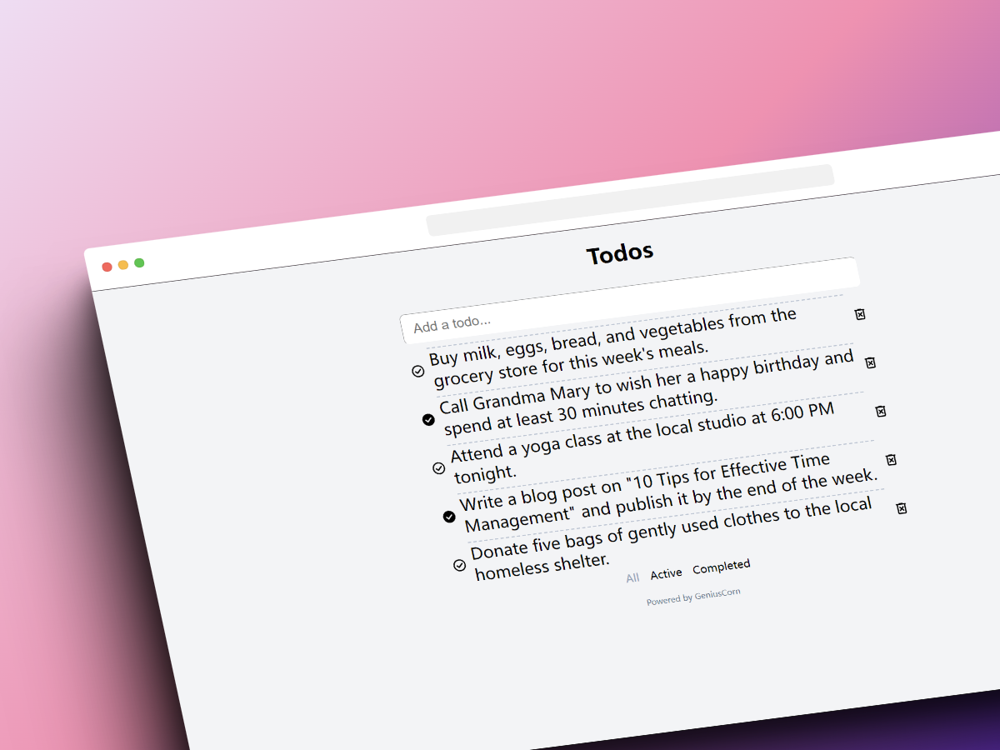

# Todo



## Introduction

Welcome to the Todo App! This is a solid implementation of the Todo Application, which allows you to manage your tasks efficiently.

## Features

- Easy task input.
- Reliable data storage.
- Categorized task viewing.
- User-friendly interface.

## Install

```sh
# clone the project
git clone https://github.com/GeniusCorn/todo.git

# enter the project directory
cd datagram

# install dependency
pnpm i

# develop
pnpm dev

# build
pnpm build
```

## Maintainer

[](https://github.com/GeniusCorn)
[@GeniusCorn](https://github.com/GeniusCorn)

## License

[MIT](license.md)
